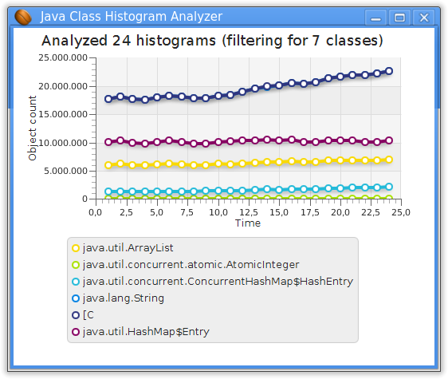

# jcha - Java Class Histogram Analyser

jcha is a tool to analyse Java class histograms, focused on histogram comparison.
It can aid in debugging memory leaks, or for finding memory dominators before issues arise.
jcha reads histograms written by "jcmd pid GC.class_histogram". It is best to
capture multiple histograms, so this package also contains jcha-capture, a script for
time-based histogram capturing.

Two or more histograms can be compared, to find classes that change a lot in number of instances
or size. You can either use the command line tool jcha  or the JavaFX GUI application jcha-gui.
Both tools support class filtering, by either giving a limit or a class list.




## Building
Build requires Maven and Java 8. All other dependencies are pulled in by Maven.
```
  mvn package assembly:single
```


## Running
You can run jcha directly from the build directory. It requires Java 7 or above.
jcha-gui requires JavaFX to be in the classpath. All Java 8 and some Java 7 installations fulfill this dependency.
```
 jcmd pid GC.class_histogram > classhistogram01.jch  # Capture a single histogram, directly with jcmd from JDK
 jcha --jmx host:port                                # Capture endlessly from a JMX enabled JVM (Java 8 server)
 jcha-capture 100 10 pid filnamePrefix               # Capture 100 histograms, delay between is 10 seconds

 jcha classhistogram01.jch classhistogram02.jch      # Start jcha with 2 *.jch files in the directory
 jcha -h                                             # for showing help on all options like sorting
 
 jcha-gui *.jch                                      # Start GUI with all *.jch files in the directory
```

Shortcut, using a shell alias:
```
 path=`pwd`
 alias jcha=$path/jcha
 alias jcha-gui=$path/jcha-gui
```

## Enhancements done since initial version
 * V1.1
 ** Correlate class statistics to find common characteristics like "growing about the same amount"
 ** Auto-selector, that finds most interesting classes for jcha-gui (a graph with 100 classes does not make much sense)
 ** Selecting classes (-C option): Implement pattern-match and also allow path-based class names like java/lang/String
 * V1.2beta
 ** Live view from running JVM by reading MBean via JMX.
     jcha --jmx host:port -U interval   
 ** Show the first derivation of the data points in the graph.
 * V1.3
 ** Capture live via JMX also in Raw format, immediately readable by jcha and jcha-gui 
 ** Quiet mode -q
 ** Initial support for a time axis in jcha-gui
 **
  
## Possible future enhancements
 * Using the classpath of the analysed application, find the culprit class causing a leak.
 * Optionally use timestamps instead of numbers as x-Axis. Either from file inode (-t [ctime|utime|atime|time])
   or filename pattern (-t name regexp)
 * Allow to specifiy time range
 * Interpolate data over time to get a uniform graph
 * Identify service restarts, to display it on the graph and for calculations (measure from time t1 until serive restart)

## Known bugs
 * In all versions
 ** Class name caption is missing in jcha-gui when showing 10 classes or more. 
 ** The window of jcha-gui does not follow resizes

## License
Apache License 2.0

Copyright 2014-present trivago GmbH

